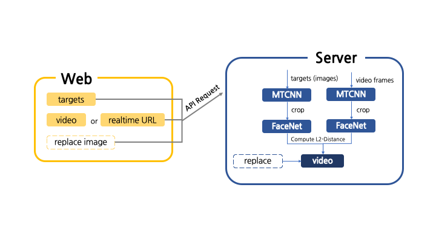

# De-facer

*KAIST 2019 Fall CS470 Introduction to Artificial Intelligence Team 13 Final Project*

Service to detect the faces from video and ***de-face***(replace with other images or blur) them.


## Motivation
Nowadays, you can easily see people who broadcast on the streets. As private broadcasts (ex. _YouTube_) are becoming more common, the issue of portrait rights infringement is also getting serious. 

Therefore, we defined our problem as '**How can we protect others’ portrait portraits in the video?**'. It is important that we must show broadcasters but not others. We came up with an idea to 1) detect faces, 2) match face with target images and 3) blur/replace other faces except for target faces. We also dealt with real-time conditions.

## Models
We used the [pytorch implementation](https://github.com/timesler/facenet-pytorch) of ["FaceNet: A Unified Embedding for Face Recognition and Clustering"](https://arxiv.org/abs/1503.03832).

## Features

### Flow


### Video de-facing


### Real-time de-facing


## Installation

### Requirements

* Python 3.5+
* macOS or Linux
* Node.js 12+

### Installing

```bash
pip3 install torch torchvision flask flask_cors facenet-pytorch opencv-python google-cloud-storage

export GOOGLE_APPLICATION_CREDENTIALS="[PATH TO server/service_key.json]" # Or use own setting
```

## Usage

### Run server
```bash
cd server
python3 manage.py
```

### Web
```bash
cd web-page
npm install
npm start
```
## Reference
- [Ant Design](https://ant.design/)